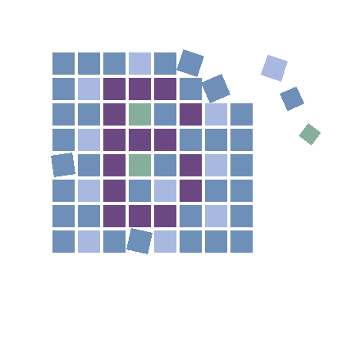

# Blitter 

[](https://github.com/mattwar/Blitter/actions/workflows/CI.yml)
[](https://www.nuget.org/packages/Blitter)
[](https://www.nuget.org/packages/Blitter)
[](LICENSE)
[](https://dotnet.microsoft.com/)

**Blitter** is a small, friendly 2D & 3D graphics programming library for .NET, built on top of [SDL3](https://www.libsdl.org/) (via the [SDL3-CS](https://github.com/edwardgushchin/SDL3-CS) bindings) and integrated with [SkiaSharp](https://github.com/mono/SkiaSharp). It wraps many of SDL3's APIs in clean, idiomatic C# classes — and bridges SkiaSharp (which draws into bitmaps) so the pixels you paint with Skia end up on screen — so you can focus on drawing things and making them move instead of wrestling with native interop and low level GPU concepts.

> ⚠️ **Early days.** Blitter is in ongoing development. The API will likely go through changes. Use at your own risk — and have fun.

## Why Blitter?

SDL3 is fantastic, but using it directly from C# means a lot of P/Invoke, unsafe code, and boilerplate. Blitter exists to give .NET developers a small, approachable surface for:

- Opening a window
- Drawing 2D images and primitives
- Drawing 3D meshes with custom shaders
- Reading keyboard, mouse, gamepad, and touch input
- Playing audio
- Loading images

…all without ever having to think about pointers or marshalling or interacting directly with the GPU.

## Features

- **`Window2D`** - bitmap/sprite-style 2D rendering
- **`Window3D`** - GPU-accelerated 3D rendering
- **SkiaSharp** Integration - Fonts, Filters, Canvas and more
- **Input** - keyboard, mouse, gamepad, and touch via simple events
- **Audio** - load and play WAV data
- **Images** - load, save, manipulate pixels, apply filters
- **Shaders** - load, save, dynamic compilation
- **`Blitter.Bits`** - beyond the basics: useful tidbits for graphical apps
- **`Blitter.Blocks`** - building blocks: sprites, scenes, panels and more

## Installation

Blitter is published as a NuGet package:

```sh
dotnet add package Blitter
```

The native SDL3 binaries are pulled in automatically via the `SDL3-CS.Native` and `SDL3-CS.Native.Shadercross` package dependencies — there is nothing to install separately.

Targets **.NET 9**.

## A 2D example

A bouncing red square.

```csharp
using Blitter;

var window = new Window2D(800, 600)
{
    Title = "Bouncing Square",
    BackgroundColor = new Color(20, 20, 40),
    CloseKey = Key.Escape
};

float x = 0, vx = 200; // pixels per second

await window.RunAsync(rd =>
{
    x += vx * rd.ElapsedSecondsSinceLastRender;
    if (x < 0 || x > window.Size.Width - 100) vx = -vx;

    rd.DrawColor = new Color(220, 60, 60);
    rd.DrawFillRect(new Rect(x, 250, 100, 100));
});
```

## A 3D example

A spinning, colored triangle rendered with a built-in shader.

```csharp
using System.Numerics;
using Blitter;

var triangle = Mesh.Create<ColorVertex3D>(
[
    new(new Vertex3D( 0.0f,  0.5f, 0f), Color.Red),
    new(new Vertex3D( 0.5f, -0.5f, 0f), Color.Green),
    new(new Vertex3D(-0.5f, -0.5f, 0f), Color.Blue),
]);

var window = new Window3D
{
    Title = "Spinning Triangle",
    BackgroundColor = new Color(0, 0, 32),
    FullScreen = true,
    CloseKey = Key.Escape
};

await window.RunAsync(r =>
{
    var transform =
        Matrix4x4.CreateRotationZ(r.ElapsedSecondsSinceStart) *
        Matrix4x4.CreateScale(0.8f);

    r.DrawMesh(triangle, transform);
});
```

More examples live in [samples/](samples/) — each is a single `.cs` file you can run directly with `dotnet run samples/<name>.cs` (.NET 10+).

## Project Layout

| Project | What it is |
| --- | --- |
| `Blitter` | Core library: windows, rendering (BMP), input, audio. |
| `Blitter.Bits` | Beyond the basics: useful tidbits for graphical apps |
| `Blitter.Blocks` | Building blocks: sprites, scenes, panels and more |
| `Blitter.Package` | Packaging project — bundles `Blitter` and `Blitter.Blocks` into the `Blitter` NuGet package. |

## Building from Source

```sh
git clone https://github.com/mattwar/Blitter.git
cd Blitter
dotnet build src/Blitter.sln
dotnet run samples/TriangleSwarm.cs
```

To produce a NuGet package locally:

```sh
dotnet pack src/Blitter.Package/Blitter.Package.csproj -c Release -o artifacts/nuget
```

## Status & Roadmap

Blitter is pre-1.0 and changes frequently. Expect rough edges, missing features, and the occasional API rename. Issues and pull requests are welcome, but please don't depend on it for anything important yet.

## Acknowledgments

Blitter stands on the shoulders of some excellent open-source projects:

- [SDL3](https://www.libsdl.org/) by Sam Lantinga and the SDL contributors — the cross-platform foundation for windowing, GPU, input, and audio.
- [SDL_shadercross](https://github.com/libsdl-org/SDL_shadercross) — runtime HLSL/SPIR-V shader translation used by `Window3D`.
- [SDL3-CS](https://github.com/edwardgushchin/SDL3-CS) by Edward Gushchin — the C# bindings for SDL3.
- [SkiaSharp](https://github.com/mono/SkiaSharp) — image decoding (PNG, JPEG, etc.) and 2D canvas drawing into bitmaps. Blitter bridges those bitmaps onto the screen.
- [SharpGLTF](https://github.com/vpenades/SharpGLTF) by Vicente Penades — glTF 2.0 (`.glb` / `.gltf`) parsing used by `Model.Load`.

Full copyright notices and license texts are reproduced in [THIRD-PARTY-NOTICES.md](THIRD-PARTY-NOTICES.md).

## License

[MIT](LICENSE). Third-party components retain their own licenses; see [THIRD-PARTY-NOTICES.md](THIRD-PARTY-NOTICES.md).
